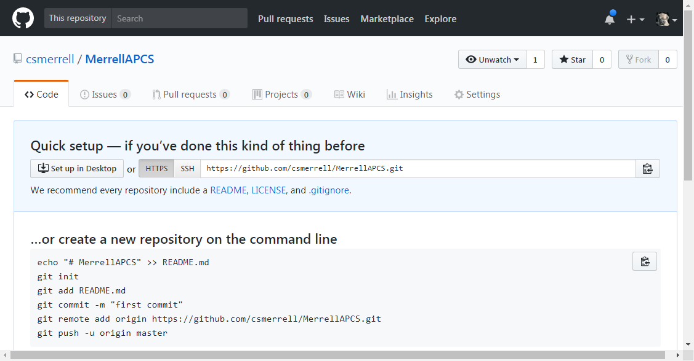
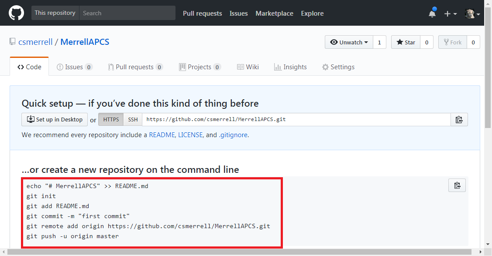
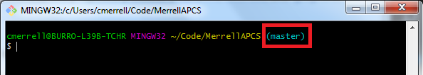
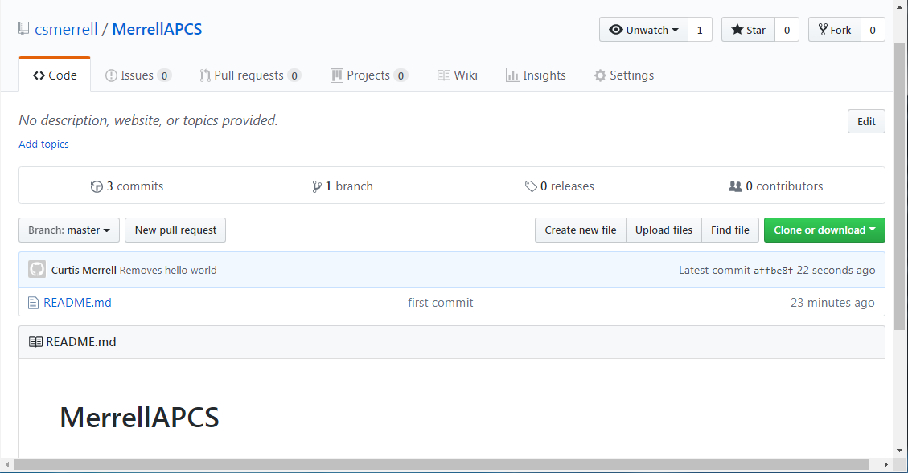
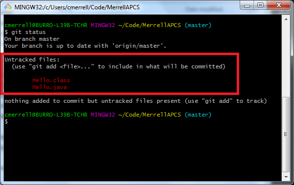
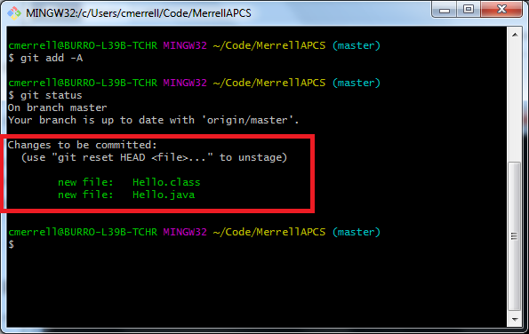

# Github
Github serves many purposes. Since most of those purpose don't have any immediate connection to the AP exam, however, we won't discuss them in the scope of this class. For this class, we will use Github primarily as a tool for redundancy and change tracking.

This assignment has two exercises, but you should read the context just below here before beginning the assignments:
* [Exercise 1](#Exercise1)
* [Exercise 2](#Exercise2)

## Redundancy
Have you ever accidentally deleted a crucial file or had your hard drive die on you? It happens to anyone and everyone at some point.

Redundancy is a bad term for most people, but in the world of digital data, we _love_ redundancy. Redundancy is the practice of storing your data in more than one location, so you can recover it if you lose it.

This is one of the great tools that github will provide us. You can store all of your code in the cloud, so it's safe even if you lose your local files.

## Change Tracking and Syncing your Code Base
Redundancy is only one benefit of storing your data in Github's cloud. Github also allows you to sync up your code base across multiple machines. Let's say you start writing a program in class, but you don't finish it. Right before you leave, you can "push" your changes up to a Github Repository. Then, when you get home, you can "pull" those changes back down.

To handle this code syncing, Github uses a software call "Git" (Git_hub_ is just a collection of "Git" repositories). Git is a content tracking software that makes these "pushes" and "pulls" efficiently.

## Terms and Commands
### Terminology
* Git
* Github
* Source Control Management (SCM) - Sometimes called "Source Code Management"
* Redundancy
* Stage
* Commit
* Push
* Pull
* Clone
* Local
* Remote

### Commands
* git add -A
* git status
* git commit -m "<Your message>"
* git push origin master
* git clone <url>
* git pull origin master
* git reset --hard
* git checkout -b

## Exercise 1 <a name="Exercise1"></a>
In this first exercise, you will create your first Git repository, you will add code to the repository, and then you will push and pull that code up and down through the cloud using the commands listed above.

1. Create a Github account if you don't already have one, then log into it.
    * Also, please send me an email with your Github username (So I can grade your work as needed).

2. On the first page after you log in, there should be a big white button that says "Start a Project." Click it.

3. From here, name your repository. Note that you will be using this repository for the remainder of this class. I would name mine something like "MerrellAPCS".
    * Leave the repository as public (private costs money)
    * Click the "Create Repository" button lower on the page.

4. You should now be at a page that looks like this:


5. Now, create a directory somewhere on your computer where you want to store all of your class work.
    * In my terminal, I just did:
    ```cd ~```
    Followed by 
    ```mkdir Code```
    This created my Code directory in my windows user file (The default file your terminal opens up to). This way, every time I open my terminal, all I have to do is type:
    ```cd Code```
    And I'm already in my code directory.

6. In your terminal, navigate into the new folder. Here you need to paste a list of commands into your terminal, but the commands will be different for each of you, because they are specific to your repository. If we look at the new repository page back on Github, the commands are listed. Look at the red box in the picture below:
    

    * You can copy that _whole_ chunk of commands and paste them all at once. Remember that paste is _Shift + Insert_ in the Git Bash Terminal
    * When you paste the whole block all at once, your terminal will automatically execute all but the last command ```git push -u origin master```. For this one, you need to hit enter manually. This command should prompt you to enter your github username and password to complete it.

7. Now, if you look at your terminal. you should see a blue label attached to your folder name that says (master) anytime you are inside of it. This means that your current directory is connected to a Git repository.
    
    * Also, if you refresh your repository page, you should see that it now looks different. It's now a fully initialized repository (it's empty, but it's ready to go).
    

8. Lets move our Hello World application into our new repository. Go find it on the desktop and move it to your repository folder.

9. Once the file is moved, type ```git status``` into your terminal. You should see some colored messages about some "Untracked files":

    

10. Before Git will upload these new files to the repository, we have to "stage" them to be added using the "Git add" command.
    ```
        git add -A
    ```
    * The '-A' parameter just means "All". For this class, you should just use the '-A' whenever you do use the git add command.

11. Now if we run 'git status' again, we should see that the files are now ready "to be committed":


12. One last step before we push our new files into the cloud. We need to write a "commit message" for these files and commit them to be pushed. Use the following command, entering your own message where I say "YOUR MESSAGE HERE":
    ```
    git commit -m "YOUR MESSAGE HERE"
    ```
    * These messages should reflect the changes you're making to your code so you can track them later. Things like "Moves Hello World Function into repo" or "Fixes bug in -SOME PART OF CODE-"

13. Now you're ready to upload the changes:
    ```
    git push origin master
    ```
    * This should ask for your github username and password again.
    * Don't worry about the 'origin master' part for now. That will just be part of all of our push statements from now on (there's more, but not part of this class).

14. Congratulations! Now if you reload your github repository, you should see that your Hello World files are inside it.


## Exercise 2 <a name="Exercise2"></a>

Now that you have a repository and you know how to push to it, you need to also learn how to pull from it.

1. Once you verify that your github repository has all of your code, delete the local version of that code.
    * In case you're unfamiliar, "local" means anything specific to the physical machine you're using. "Remote" would be the files and other stuff saved up in the cloud.
    * You should delete the _whole_ folder at the point where it has been initialized to the git repository. (i.e. - I would delete the whole "MerrellAPCS" folder on my machine).

2. Now that you don't have any of your local code, open up your repository on Github and find the green "Clone or download" button near the top right of the page. Clicking the button will bring up a menu:
    

3. From this menu, copy the ```https://``` url.
    * Make sure that you have a url beginning with ```https://``` and not ```ssh```. Ssh urls use stronger security measures, but require some complicated configuration. Https urls will be sufficient for now.

4. In your terminal, navigate to the folder where your code used to be (For me this was the "Code" folder). Once at the correct folder, run a ```git clone``` command:
```git clone YOUR_URL```
For me the command was
```git clone https://github.com/csmerrell/MerrellAPCS.git```

5. Type ls into your terminal window to see that it recreated your repository. If you cd into the folder you will see that all of the files from your repository have been cloned into it. 
    * When you run clone, note that it does not turn your _current_ folder into the git repository. It creates a _new_ folder that is a clone of the repository.

6. Now that you have cloned your repository, you can work on your code from any computer, anywhere. Any time you find yourself needing to work on your project from a new computer, just clone the repository to the new computer.

7. Once you have your code spread across multiple computers, it is important to make sure that you keep them in sync with each other.
    * The best strategy to keep all of your work in sync is to:
    * ```git pull origin master``` every time you start working on any machine
    * ```git push origin master``` any time you are done working on any machine
        * Remember that every push command first requires a ```git add``` and a ```git commit``` command.

8. To practice this habit, open another terminal and create a new folder somewhere else called "School" or "Home" to represent the _other_ location where you might need to work on your code.

9. Navigate your second terminal into this "School" or "Home" folder and clone your repository here. You should have two versions of your repository on your one computer, now.
    * These two folders don't know about each other's existence. Each one of them is connected to the Github repository, though, so we can sync them.

10. In your original repository, make some sort of changes.
    * i.e. - Add another print statement to Hello.java, or add a description of your repository to the README.md file.

11. Push these changes up to the Github repository
    * Remember that a push consists of 3 steps
        1. ```git add -A```
        2. ```git commit -m "YOUR MESSAGE"```
        3. ```git push origin master```

12. Once your changes have been pushed up into the Github repository, go to the terminal for your "alternate location" (Home or School folder).

13. Here, run the command
    ```
    git pull origin master
    ```
    * This should pull whatever changes you made to your code into the alternate location. Verify that the changes got pulled down properly.

14. For familiarization, now make some changes in the alternate location, then push them up and pull them down to the original folder.