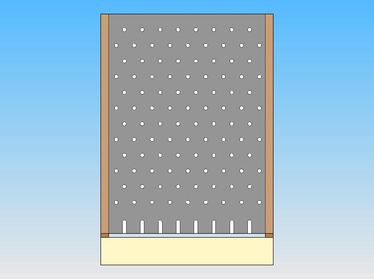

# Plinko


Plinko used to be more common back when _The Price is Right!_ was still popular on tv. Now if you've seen it, it was probably at a local fairgrounds or carnival or something.

In Plinko, you drop a ball or a disc into one of the 9 slots at the top of the board and it bounces down through the pegs, shifting left and right until it lands in one of the 9 slots at the bottom of the board, where each of the slots has a point value for your winnings.

Note that this project is worth twice as many points as the Loan Calculator. Expect this project to really challenge your skills. Also expect to come out of this project much more confident in those skills.

## Requirements
1. Prompt the user to select one of 3 modes:
    * (1) Single Disc
    * (2) Multi Disc
    * (3) Quit
    * NOTES:
        * The _whole_ program will be inside of a ```while(true)``` loop which only breaks if the user selects the "Quit" option (3) from the starting menu.
        * If the user selects an invalid option, simply reprompt them with the same menu.

2. Based on the mode selection, execute the appropriate command:

### Single Disc Mode
1. Prompt the user to select which position they want to drop their Plinko disc into.
    * There are 9 possible positions the user can select: 0, 1, 2, .., 7, 8.
    * If the user enters an invalid option, re-prompt them.

2. Begin moving the disc down through each row of pegs until it reaches a final slot.
    * There are 13 rows of pegs, including the first row and the final slots.
    * You do not need to move the disc for the first row. This is the slot that the user selects.
        * This means your disc should shift **12 times** before it reaches the destination.
    * At each row, the plinko disc should move left (- position) or right (+ position) but it should only move 1 position each row
        * If you look at the plinko board, you'll see that every alternating row has "half" positions. These will present a problem to you because the user is required to enter an integer value between 0 and 8. You can either:
            * Multiply the user input by 2, so inputs of 0,1,..,7,8 become inputs of 0,2,..,14,16.
                * This lets you stay in the integer data type.
            * Or you can convert the integer input to a double.
                * If you do this, each shift in the next step will be a position shift of .5 instead of 1.
        * There are boundaries to the Plinko board:
            * A disc cannot move left if it is in the leftmost position (0).
            * A disc cannot move right if it is in the rightmost position (8/16).
    * You will need to use a random number to determine if the disc should shift left or right.
        * For help with random numbers, find the additional resources section at the bottom, or click [here](#RandomNumbers).

3. At each row in single ball mode, the application should print out a visual representation of its row. After all the rows are complete, a the printout should look something like this:

    ```
         . . . .O. . . .
        . . . .O. . . . .
         . . . .O. . . .
        . . . .O. . . . .
         . . .O. . . . .
        . . .O. . . . . .
         . .O. . . . . .
        . . .O. . . . . .
         . . .O. . . . .
        . . .O. . . . . .
         . . .O. . . . .
        . . .O. . . . . .
         . . .O. . . . .
    ```
    * This printout can be done using a for loop. For example, I print my even-numbered rows using this for loop (I used the 16 position method):    
        ```java
            for(int i = 0; i <= 16; i++) {
                if(position == i) {
                    System.out.print("O");
                }
                else if(isEven(i)) {
                    System.out.print(".");
                }
                else {
                    System.out.print(" ");
                }
            }
            System.out.print("\n");
        ```
        * Your odd rows should look different than the even numbered rows. What needs to change in this for loop to correctly print the odd numbered rows?

4. Once the disc has reached its destination, print out the position as well as the number of points the user won for landing in that position.
    * The points should come from a ```VALUES``` integer array which is provided with the initial code. The contents of the VALUES array should be as follows:
        * ```Java int[] VALUES = {1, 3, 2, 0, 5, 0, 2, 3, 1}; ```
    * If you need help reading data from the array, there are some explanations of arrays at the bottom of this document (or you can click [here](#arrays)).
    * The values array has 9 positions corresponding to the 9 positions where your plinko disc can end up.
        * VALUES[0] corresponds to position 0; VALUES[1] corresponds to position 1; and so on.
    * The output of the result should be something like:
    ```
        Your disc ended in position 4 and you won 5 points.
    ```

5. Once the single disc game is complete, the application should re-prompt the user with the original mode selection menu.

### Multi Disc Mode
1. Like the single disc mode, the multi-disc mode should begin by prompting the user to select a slot where they would like to drop their discs.
    * This selected slot will be used for ALL of the plinko discs.
    * Valid selections for this input are identical to the single disc mode.

2. In multi-disc mode, we also need to ask the user how many discs they would like to drop into the board.
    * The number of discs should be an integer greater than 0.
    * Users should be re-prompted if they provide invalid input.

3. Each disc should be run through the plinko board now, with each disc's result stored.
    * Storage should follow one of two methods:
        * Declare 9 "discsInPosition" variables: ```int discsIn1, discsIn2, discsIn3, etc...```).
            * This method will require a large if/else chain.
        * Declare a "results" int array with 9 values all initialized to 0: ```int[] results = {0, 0, 0, 0, 0, 0, 0, 0, 0};```
            * If your final position is a number between 0 and 8, you can just increment the value at that position in the array: ```results[position]++;```
    * **DO NOT** print the plinko board during the multi-disc mode. We will be dropping a large number of discs into the board. We don't want to overflow the terminal with board printouts.

4. Print out the number of discs in each slot of the plinko board.

5. Print out the total points earned by summing the value for all of the discs dropped.

6. When complete, re-prompt the user to select one of the 3 modes.

## Provided Code
The Plinko.java file in here contains some basic code to get you started if you choose to use it.

## Demo Class
A demo of the working Plinko game is also included here as ```PlinkoDemo.class```. You can download this individual file from Github to a folder of your choice and run it from that folder using ```java PlinkoDemo```.

## Additional Resources
### Random Numbers
Java has a ```Math``` class that we used in our loan calculator to calculate exponential powers (```Math.pow()```). Math has a number of other helper functions, one of which is the ```Math.random()``` function.

The ```Math.random()``` function returns a random double between 0 and 1. We can use the result of the function to determine whether we shift left or right:

```Java
    if(Math.random() > .5) {
        //Shift Right
    } else {
        //Shift Left
    }
```

Just remember that you can't shift left or right if you're already at the leftmost or rightmost positions, respectively.

### Arrays <a id="arrays" name="arrays" />
We haven't formally learned arrays, but the applications for arrays in this project are really simple. You only need to know how to initialize and read data from arrays.

#### Initializing an Array
```Java
    int[] numArray = {0, 0, 0, 0};
```

The above code declares and defines an array with 4 values. We set each of those four values to 0. Notice the ```[]``` brackets after the ```int``` type. These brackets turn a singular data type into an array of that data type. You could do the same thing with any data type:

```Java
    double[] dblArray = {0, 0, 0, 0};
    String[] strArray = {"Hello", "Hi", "Hey"};
```

#### Reading From an Array
Let's go back to our basic integer array:
```Java
    int[] numArray = {0, 0, 0, 0};
```

Once an array has been initialized, we can look at the individual values inside the array by accessing their _position_ within the array. This is done with the syntax ```numArray[position]```:

```Java
    int[] numArray = {0, 0, 0, 0};
    int num0 = numArray[0]; //position 0
    int num1 = numArray[1]; //position 0
    int num2 = numArray[2]; //position 0
    int num3 = numArray[3]; //position 0
```

Note that the first position of an array is position **0**.

If we want to increment or change the data at a position, we can do that as well:

```Java
    int[] numArray = {0, 0, 0, 0};

    numArray[0]++; //Increment the value at position 0 of the array;
    System.out.println(numArray[0]); //Prints 1, because position 0 is now equal to 1.

    numArray[1] = 4; //Assign the value 4 to position 1 of the array;
    System.out.println(numArray[1]); //Prints 4, because position 1 is now equal to 4.    
```

After the two operations from the snippet above, the numArray would no longer be full of 0's. Its contents would be ```{1, 4, 0, 0}``` because we changed the values stored at positions 0 and 1.
